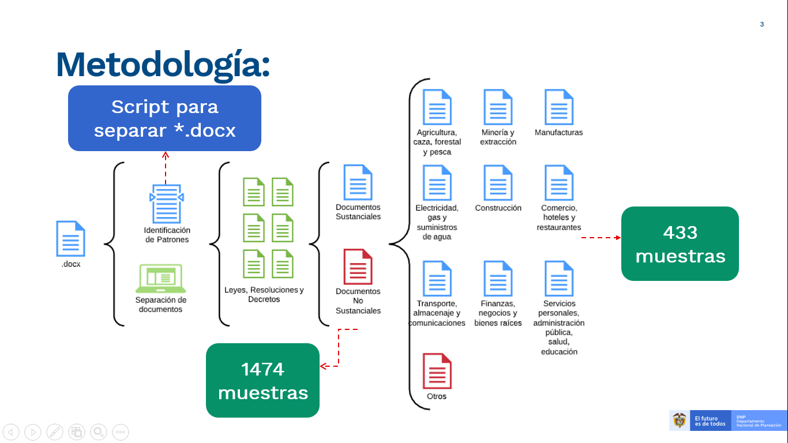

# **Herramienta para la clasificación de documentos de Mejora Normativa**

Esta herramienta contiene los scripts para la clasificación de documentos de mejora regulatoria, utilizando técnicas de procesamiento de texto, en tres pasos:

1. Clasificar cada documento como documento sustancial y no sustancial
2. Después de que un documento ha sido clasificado como sustancial, se clasifica en uno de los 9 sectores productivos (CIIU) o en un documento administrativo
3. Se reporta la información en una tabla de Excel que contiene el nombre del documento y sus asignaciones a cada sector

## Librerías Python

Para instalar las librerías necesarias para correr la herramienta

`pip install - r requirements.txt`

**Nota:** Se recomienda crear un entorno virtual antes.

## Diccionario de archivos principales

**01_loadDB.py**

Script para cargar la base de datos de Mejora regulatoria desde 1991-2014 en formato txt (ver variable path) y la lista de documentos que se encuentra en el archivo csv (ver variable dicc). Este script carga los documentos y aplica un proceso de limpieza de texto.

**02_training_S_NS.py**

Este script se encarga del entrenamiento para modelo sustancial / no sustancial, utilizando la base de datos generada por el script <01_loadDB.py> y guardada en la carpeta del proyecto <data>. Este script guarda cada uno de los modelos entrenados en la carpeta <models> y un archivo de texto donde se reportan los rendimientos de cada uno de ellos en la carpeta raíz.

**03_generate_model_S_NS.py**

Script para generar modelo de clasificación sustancial (S) / No sustancial (NS) con los mejores parámetros encontrados por el script <02_training.py>. Este script guarda el modelo en la carpeta <models> con la etiqueta timestamp-final_model_s_ns.pkl

**04_training_sectors.py**

Script para realizar el proceso de entrenamiento de modelos para la clasificación de las normas en 9 sectores productivos y un sector transversal. El script carga la base de datos generada por <01_loadDB.py> almacenada en la carpeta <data> del repositorio. El script prueba diferentes modelos y los guarda en la carpeta <models>, también genera un archivo txt donde se reportan los rendimientos de cada clasificador para escoger los mejores parámetros.

**05_generate_model_sectors.py**

Script que genera el modelo con mejor desempeño encontrado en el script <04_training_sectors.py>. Este modelo se guarda en la carpeta <models> con la etiqueta timestamp-final_model_sectors.pkl. la variable timestamp es la fecha y
hora en la que se generó el modelo.

**06_final_model.py**

Script para realizar la clasificación de los txt guardados en la base de datos generada por <01_loadDB.py> y clasificarlos por sustancial - no sustancial, paso siguiente si el documento es clasificado como sustancial este pasa por la clasificación de los 9 sectores productivos. Este script carga el modelo generado por <03_generate_model_S_NS.py> para la clasificación sustancial/no-sustancial y el modelo generado por <05_generate_model_sector.py> para la clasificación en los 9 sectores productivos. Ambos modelos guardados en la carpeta <models>.

**06_final_model_wordFiles.py**

Script para realizar la clasificación de los archivos de Word que han sido separados y procesados por <parseWordFiles.py> y guardados en la carpeta <data> y clasificarlos por sustancial - no sustancial, paso siguiente si el documento es clasificado como sustancial este pasa por la clasificación de los 9 sectores productivos. Este script carga el modelo generado por <03_generate_model_S_NS.py> para la clasificación sustancial/np-sustancial y el modelo generado por <05_generate_model_sector.py> para la clasificación en los 9 sectores productivos. Ambos modelos guardados en la carpeta <models> .

## Archivos auxiliares 

**limpieza_texto.py**

Script con funciones útiles para la limpieza de texto utilizadas en el proyecto.

**load_stopwords.py**

Script que carga y quita las stopwords de un texto, útil para la limpieza de texto.

**merge_new_labels.py**

Archivo para unir la base de datos pickle de los 11,110 documentos que ya tienen la limpieza de texto  con una nueva revisión de etiquetas por parte del experto.

**parseWordFiles.py**

Script donde se encuentran las funcionalidades para leer los archivos Word y devolver los textos planos separados para su posterior análisis. 

## Autores

[David Insuasti](https://github.com/davidinsuasty)

[Unidad de Cientificos de Datos ](https://github.com/ucd-dnp)

## Contacto

[David Insuasti](mailto:davidinsuasty@gmail.com?subject=[GitHub]%20Mejora%20Normativa)

[Unidad de Cientificos de Datos](mailto:ucd@dnp.gov.co?subject=[GitHub]%20Mejora%20Normativa)